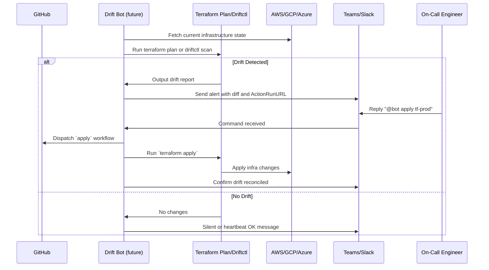

# Terragrunt Import From Plan

[](https://github.com/casibbald/terragrunt-import-from-plan/actions/workflows/test.yml)
[](https://github.com/casibbald/terragrunt-import-from-plan/actions/workflows/release.yml)

### 🤔 Why Use This Action?

When running `terragrunt plan`, you may have resources marked for creation but not yet in the Terraform state. This action
helps you automatically import those resources using **intelligent, schema-driven analysis** to ensure your state file is up-to-date without manual intervention.

**🧠 What Makes This Different:** Unlike tools that guess which resource attributes to use for imports, this action uses **real Terraform provider schema data** to intelligently select the correct identifiers for each resource type. Supporting **1,064+ Google Cloud resource types** automatically, it knows that `repository_id` is best for artifact registries, `bucket` for storage, and `arn` for AWS resources.

This is particularly useful for CI/CD pipelines where you want to ensure all resources are managed correctly without having
to run `terraform import` commands manually. 

It is beneficial in corporate settings where environments use restrictive GCP, AWS, or Azure IAM, requiring complex service 
account impersonation. Often, direct access to import resources is not always possible in the local environment, or is tedious 
to set up, or there are security restrictions from having local access to these environments, especially in Production settings. 

This resource ensures your Terraform state remains consistent with the infrastructure, reducing the risk of drift mid-deployment through **higher import success rates** and **more reliable resource identification**.

### 🚀 Features

- 🔍 Parses `terraform show -json` output from a Terraform plan
- 📦 Dynamically identifies resources with `create`, `create+update`, or `replace` actions
- 🔑 **Intelligently selects** importable IDs using schema-driven analysis - automatically knows the best identifier for each of 1,064+ resource types
- 🛠 Supports optional cloud-specific ID formatting:
  - **GCP**: prefix `projects/$PROJECT_ID/locations/$LOCATION/repositories/...`
  - **AWS**: uses raw `arn:` strings when detected (e.g., `arn:aws:iam::...:role/...`)
  - **Azure**: uses full `/subscriptions/...` IDs directly
- 📊 Outputs a summary of:
  - Imported resources
  - Already in state
  - Skipped (due to missing ID)

## 🧠 Schema-Driven Intelligence

**What sets this tool apart:** Instead of guessing which resource attributes to use for imports, this tool uses **real Terraform provider schema data** to make intelligent decisions.

### 🎯 **Real Intelligence, Not Hardcoded Guesses**

```rust
// ❌ Traditional tools: Hardcoded guessing
let priority_order = vec!["id", "name", "bucket"]; // Same for all resources

// ✅ This tool: Schema-driven intelligence
let candidates = schema_manager.get_id_candidate_attributes("google_storage_bucket");
// Returns: [("name", 55.0, required=true), ("location", 50.0, required=true), ("project", 50.0, computed=true)]
```

### 📈 **Massive Scale Support**

- **1,064+ Google Cloud resource types** automatically supported
- **Zero maintenance** for new resource types - automatically inherits from provider schema
- **Resource-specific intelligence** - knows that `repository_id` is best for artifact registries, `bucket` for storage

### 🔬 **How It Works**

1. **Schema Analysis**: Parses the full 6.3MB `.terragrunt-provider-schema.json` file
2. **Intelligent Scoring**: Evaluates attributes based on:
   - ✅ **Required fields** (higher priority - essential to the resource)
   - ✅ **Computed fields** (often auto-generated IDs)
   - ✅ **String types** (better for human-readable identifiers)
   - ✅ **Resource-specific patterns** (e.g., `repository_id` for registries)
3. **Dynamic Selection**: Chooses the most appropriate identifier for each resource type

### 🎯 **Real-World Examples**

| Resource Type | Top Candidates | Why It's Smart |
|---------------|----------------|----------------|
| `google_storage_bucket` | `name` (55.0) → `location` (50.0) → `project` (50.0) | Required fields prioritized over computed |
| `google_artifact_registry_repository` | `repository_id` (top) → `location` → `name` | Resource-specific intelligence |
| `aws_iam_role` | `arn` (highest) → `name` → `id` | AWS ARN patterns recognized |

### 🛡️ **Trust & Reliability**

- **No more guessing** - Uses actual Terraform provider definitions
- **Comprehensive coverage** - Supports all Google Cloud resources automatically
- **Future-proof** - New resources supported without code changes
- **Extensively tested** - 5 comprehensive schema integration tests validate real-world scenarios

**The Result:** Higher import success rates, fewer failed operations, and confidence that the tool understands your infrastructure as well as Terraform does.

### 🧪 Included Test Suite

Run `cargo test` to validate logic with comprehensive test coverage — no infrastructure required.

---

## ⚠️ **Important: Terraform State Limitations**

**🚨 SEQUENTIAL OPERATIONS ONLY**

This tool executes import operations **sequentially** by design. Terraform and Terragrunt state management:

- **Cannot handle concurrent operations** - Parallel imports will corrupt state
- **Use file-based locking** - Simultaneous access causes conflicts
- **Require sequential execution** - One import at a time for state safety

**Why This Matters:**
- Ensures state file integrity and prevents corruption
- Maintains consistent infrastructure tracking  
- Follows Terraform/Terragrunt architectural constraints
- Provides reliable operation in CI/CD pipelines

For large plans with many resources, the tool optimizes for **speed within sequential constraints** through efficient processing, smart caching, and progress reporting.

---

## 🛠 Usage

```yaml
jobs:
  import-plan:
    runs-on: ubuntu-latest
    steps:
      - uses: actions/checkout@v4

      - name: Set up Terragrunt
        uses: metro-digital/cf-github-actions/terragrunt-setup@v1.0.0

      - name: Terragrunt Plan
        run: terragrunt plan -out=${{ github.sha }}.plan
        working-directory: ${{ github.workspace }}/${{ matrix.environment }}/some-module

      - name: Import resources from plan
        uses: casibbald/terragrunt-import-from-plan@v1.0.0
        with:
          working-directory: ${{ github.workspace }}/${{ matrix.environment }}/some-module
          plan-file: ${{ github.sha }}.plan
```

### 🌍 Cloud-Specific Settings

#### For GCP:

Optionally set `PROJECT_ID` and `LOCATION` as environment variables for GCP-style imports:

```yaml
env:
  PROJECT_ID: your-project-id
  LOCATION: your-location
```

#### For AWS or Azure:
If your resources use `arn:` or `/subscriptions/...`, no additional variables are needed — the action detects and imports using them directly.

---

## 📄 Output Example

```
🔍 Checking google_artifact_registry_repository.remote_repos["mock-repo"]...
📦 Importing google_artifact_registry_repository.remote_repos["mock-repo"] with ID: projects/my-project/locations/europe-west1/repositories/mock-repo

✅ Import Summary
Imported:   1
Already in state: 0
Skipped:     0

📦 Imported Resources:
google_artifact_registry_repository.remote_repos["mock-repo"]
```

### 📄 Example Plan JSON Snippets

#### GCP Artifact Registry
```json
{
  "address": "google_artifact_registry_repository.remote[\"foo\"]",
  "change": {
    "actions": ["create"],
    "after": {
      "repository_id": "foo"
    }
  }
}
```

#### AWS IAM Role
```json
{
  "address": "aws_iam_role.role[\"app\"]",
  "change": {
    "actions": ["create"],
    "after": {
      "arn": "arn:aws:iam::123456789012:role/app"
    }
  }
}
```

#### Azure Storage Account
```json
{
  "address": "azurerm_storage_account.example[\"main\"]",
  "change": {
    "actions": ["create"],
    "after": {
      "id": "/subscriptions/0000-1111-2222-3333/resourceGroups/rg/providers/Microsoft.Storage/storageAccounts/myaccount"
    }
  }
}
```

---

## 🛣️ Roadmap: Terraform Drift Detection Bot

This project is evolving into a full-featured **Terraform Drift Detection Bot** with the following capabilities:

| Feature | Status | Description |
|--------|--------|-------------|
| GitHub Actions Integration | ✅ Live | CI integration for automatic imports and testing |
| Drift Detection | 🔜 Planned | Detects drift between Terraform code and real infrastructure using `terraform plan` or `driftctl` |
| Alert Routing | 🔜 Planned | Sends alerts to Slack, Teams, or webhook endpoints when drift is detected |
| ChatOps Apply | 🔜 Planned | On-call engineers can trigger `terraform apply` directly from chat (e.g. `@driftbot apply prod`) |
| Cloud Push Events | 🔜 Planned | Uses AWS Config, GCP Audit Logs, or Azure Monitor to detect changes in real time |


### Planned Architecture



---

## 🔭 Vision

This tool will become a critical piece of infrastructure management by:
- Catching infrastructure drift proactively
- Allowing GitOps-compliant resolution
- Delivering alerts and approvals through chat integrations
- Supporting multi-cloud teams with confidence and automation

The `terragrunt-import-from-plan` crate is just the beginning.

---

## Testing

### 🧰 Tech Stack

**Core Technology:**
- **Language**: Rust 2021 Edition
- **CLI Framework**: `clap` v4 with derive features
- **JSON Processing**: `serde` and `serde_json` for parsing Terraform plan files
- **Error Handling**: `anyhow` for error context and `thiserror` for custom error types
- **File Operations**: `glob` for pattern matching, `tempfile` for testing
- **Regex**: Advanced pattern matching for resource ID extraction

**Development Tools:**
- **Testing**: Native Rust testing framework with `cargo test`
- **Coverage**: `cargo-llvm-cov` for detailed coverage reports
- **Build System**: Cargo with workspace support


### 📊 Test Coverage

**Total Tests: 59** ✅
- **Unit Tests**: 15 tests (module-specific functionality)
- **Binary Tests**: 21 tests (CLI and integration logic) 
- **Integration Tests**: 18 tests (end-to-end scenarios)
- **Schema Integration Tests**: 5 tests (schema-driven intelligence validation)

### Test Categories

#### 1. **Resource Collection Tests** (`test_01` - `test_03`)
- `test_01_collect_resources` - Basic resource collection from modules
- `test_02_collect_resources_consolidation` - Nested module resource collection
- `test_03_collect_resources_empty_module` - Edge case handling for empty modules

#### 2. **Schema Extraction Tests** (`test_04` - `test_06`)
- `test_04_extract_id_candidate_fields` - Provider schema parsing
- `test_05_extract_id_candidate_fields_empty_schema` - Empty schema handling
- `test_06_extract_id_candidate_fields_missing_provider` - Missing provider handling

#### 3. **ID Candidate Field Tests** (`test_07` - `test_09`)
- `test_07_get_id_candidate_fields` - ID field extraction from schemas
- `test_08_get_id_candidate_fields_empty` - Empty schema edge cases
- `test_09_get_id_candidate_fields_less_than_three` - Minimal field scenarios

#### 4. **Provider Schema Tests** (`test_10`)
- `test_10_load_provider_schema_invalid_file` - Invalid JSON file handling

#### 5. **Attribute Scoring Tests** (`test_11` - `test_12`)
- `test_11_score_attributes_for_id` - ID field scoring algorithm
- `test_12_score_attributes_for_id_empty` - Empty attribute handling

#### 6. **Import Command Generation Tests** (`test_13`)
- `test_13_generate_import_commands` - Terragrunt import command construction

#### 7. **Resource ID Inference Tests** (`test_14`)
- `test_14_infer_resource_id` - Resource ID inference from plan data

#### 8. **Module Mapping Tests** (`test_15`)
- `test_15_map_resources_to_modules` - Resource-to-module mapping logic

#### 9. **Terragrunt Integration Tests** (`test_16`)
- `test_16_run_terragrunt_import_mock` - Mock terragrunt command execution

#### 10. **Module Directory Validation Tests** (`test_17`)
- `test_17_validate_module_dirs` - Module directory structure validation

#### 11. **Provider Schema Generation Tests** (`test_18`)
- `test_18_generate_provider_schema_in_real_env` - Real environment schema generation

#### 12. **Schema Integration Tests** (Schema-Driven Intelligence)
- `test_schema_manager_parse_real_attributes` - Real schema parsing with 1,064+ resource types
- `test_artifact_registry_repository_parsing` - Resource-specific metadata extraction  
- `test_schema_driven_id_candidates` - Intelligent candidate ranking and scoring
- `test_list_resource_types` - Complete resource type enumeration from schema
- `test_metadata_scoring_logic` - Attribute scoring algorithm validation

### Running Tests

```bash
# Run all tests
cargo test

# Run tests with output
cargo test -- --nocapture

# Run tests in a single thread (recommended for integration tests)
cargo test -- --test-threads=1

# Run specific test
cargo test test_name

# List all available tests
cargo test -- --list
```

### Code Coverage

The project uses `cargo-llvm-cov` for code coverage reporting. To generate coverage reports:

```bash
# Generate HTML coverage report
cargo llvm-cov --all-features --workspace --html

# Generate coverage report and open in browser
cargo llvm-cov --all-features --workspace --html --open
```

Coverage reports are generated in `target/llvm-cov/html/`.

### Error Handling

The test suite includes comprehensive error handling tests that:
- Verify expected error conditions with proper error context
- Provide clear error messages for debugging
- Include detailed output (stdout/stderr) for troubleshooting
- Maintain test isolation and proper cleanup
- Test graceful degradation in environments without cloud access

## Contributing

When adding new tests:
1. Follow the existing naming convention (`test_XX_` with sequential numbering)
2. Include comprehensive error handling tests where appropriate
3. Add clear documentation for expected behaviors
4. Update this documentation with any new test categories
5. Ensure tests are deterministic and don't require external infrastructure

# Contributing

## Rust version

### 🧪 Run Tests

```bash
cargo test
```

### Run Locally

```bash
 cargo run -- --plan tests/fixtures/out.json --modules tests/fixtures/modules.json --module-root simulator/modules --dry-run

```

## Legacy Bash version

### 🧪 Run Tests

```bash
./test/entrypoint_test.sh
```

This will run a mocked import against a fake `plan.json` and show the correct import logic.


---

## 🛡 License
[MIT](LICENSE)

## Coverage Reports

To generate the LLVM coverage report, run:

```bash
cargo llvm-cov --html
```

The coverage report is saved to `target/llvm-cov/html`.
