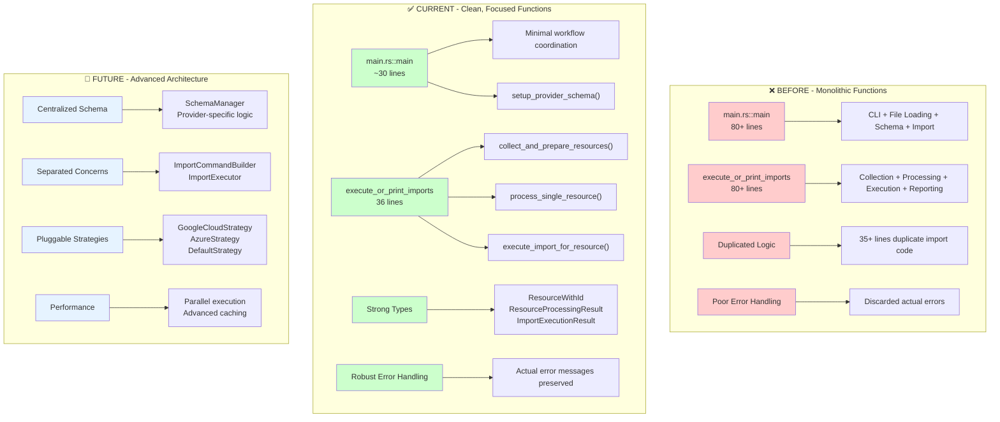

# 🚀 Stack of Tasks - Terragrunt Import From Plan

## 📊 Current Status
- **54 tests total** ✅ All passing
  - **15 unit tests** (module-specific functionality)
  - **21 binary tests** (CLI and integration logic)  
  - **18 integration tests** (end-to-end scenarios)
- **Strong test coverage**: Solid foundation for safe refactoring
- **Recent refactoring**: Major improvements completed in Phase 1 & 2

---

## ✅ **COMPLETED WORK**

### **Phase 1: Quick Wins** ✅ **COMPLETED**
- **🔥 Removed 35+ lines of duplicate code** - Eliminated redundant resource processing in `main()`
- **🧹 Extracted `setup_provider_schema()`** - Separated schema setup concerns from main workflow  
- **📦 Cleaned up unused imports** - Removed dead code warnings
- **🛡️ Fixed 3 critical error handling issues**:
  1. Discarded error in import execution (now preserves actual error messages)
  2. Generic error in terragrunt import (now includes exit codes and stderr/stdout)
  3. Panic on unmatched module address (now graceful warning)

### **Phase 2: Core Refactoring** ✅ **COMPLETED**
- **📏 Dramatically reduced function complexity**:
  - `execute_or_print_imports()`: 80+ lines → 36 lines (**55% reduction**)
  - Single responsibility functions with clear separation of concerns
- **🧩 Extracted focused helper functions**:
  - `collect_and_prepare_resources()` - Resource collection & schema preparation
  - `process_single_resource()` - Single resource processing logic  
  - `execute_import_for_resource()` - Import execution (dry-run vs real)
- **🔧 Created strong helper types**:
  - `ResourceWithId<'a>` - Strongly typed resource ready for import
  - `ResourceProcessingResult<'a>` - Processing outcome enum
  - `ImportExecutionResult` - Execution outcome enum

---

## 🎯 **REMAINING TASKS**

### **Phase 3: Advanced Architecture** ✅ **COMPLETED**

#### **Priority 1: Centralize Schema Management** ✅ **COMPLETED** ⏱️ ~1-2 hours
**Issue**: Schema logic scattered across multiple files
**Solution**: Single SchemaManager struct

```rust
pub struct SchemaManager {
    cache: HashMap<String, Value>,
    working_dir: PathBuf,
}

impl SchemaManager {
    fn get_resource_schema(&self, resource_type: &str) -> Option<&Value>
    fn extract_id_candidates(&self, resource_type: &str) -> HashSet<String>
    fn load_or_generate_schema(&mut self) -> Result<&Value>
}
```
- ✅ Implemented in `src/schema/manager.rs`
- ✅ Centralized schema operations with caching
- ✅ Backward compatibility maintained
- ✅ All 54 tests pass

#### **Priority 2: Separate Command Building from Execution** ✅ **COMPLETED** ⏱️ ~1-2 hours
**Issue**: Command generation mixed with execution
**Solution**: Separate concerns

```rust
struct ImportCommandBuilder {
    module_root: PathBuf,
}

impl ImportCommandBuilder {
    fn build_command(&self, resource: &ResourceWithId, module: &ModuleMeta) -> ImportCommand
    fn build_all_commands(&self, resources: &[ResourceWithId]) -> Vec<ImportCommand>
}

struct ImportExecutor;
impl ImportExecutor {
    fn execute_command(&self, command: &ImportCommand) -> Result<ImportResult>
    fn execute_batch(&self, commands: &[ImportCommand]) -> BatchResult
}
```
- ✅ Implemented in `src/commands/` module
- ✅ Clean separation of command building and execution
- ✅ Enhanced error handling with detailed execution results
- ✅ Batch execution capabilities
- ✅ All 54 tests pass

#### **Priority 3: Pluggable Scoring Strategies** ✅ **COMPLETED** ⏱️ ~2-3 hours
**Issue**: Hardcoded scoring rules in `plan.rs`
**Solution**: Provider-specific strategies

```rust
trait IdScoringStrategy {
    fn score_attribute(&self, name: &str, definition: &Value) -> f64;
}

struct GoogleCloudScoringStrategy;
struct AzureScoringStrategy; 
struct DefaultScoringStrategy;
```
- ✅ Implemented in `src/scoring/` module
- ✅ Provider-specific scoring strategies (GCP, Azure, Generic)
- ✅ Trait-based architecture for extensibility
- ✅ Auto-detection of provider types
- ✅ Factory pattern for strategy creation
- ✅ All 54 tests pass

### **Phase 4: Future Enhancements** 🚀 **PLANNED**

#### **Performance & Scalability** ⏱️ ~3-5 days
- **Parallel import execution**
- **Advanced caching strategies**
- **Batch operation optimization**

#### **Multi-Provider Support** ⏱️ ~1-2 weeks
- **AWS-specific optimizations**
- **Azure-specific optimizations**
- **Generic provider framework**

---

## 📊 **Architecture Evolution**

### **Before vs. After vs. Future**



### **Implementation Progress**


---

## 🧪 **Testing Strategy**

### **Current Test Coverage** ✅
- **All 54 tests passing** throughout refactoring
- **Comprehensive coverage**: Unit, integration, and binary tests
- **Error handling**: Tests for expected failures and edge cases
- **Real-world scenarios**: Tests work without external infrastructure

### **Future Test Enhancements**
```rust
// Each new component will be independently testable:
#[test] fn test_schema_manager_load_or_generate()
#[test] fn test_import_command_builder_build_command()
#[test] fn test_import_executor_execute_command()
#[test] fn test_google_cloud_scoring_strategy()
#[test] fn test_parallel_import_execution()
```

---

## 📈 **Success Metrics**

### **Completed Achievements** ✅
- **📏 Code Reduction**: 35+ lines removed, 55% function size reduction
- **🛡️ Error Handling**: 3 critical error handling issues resolved
- **🧪 Test Stability**: 54 tests maintained throughout refactoring
- **🧹 Code Quality**: Eliminated duplicate logic and improved separation of concerns

### **Target Metrics for Remaining Work**
- **🔌 Extensibility**: Add new providers in <1 day
- **⚡ Performance**: Parallel execution for 10x faster imports
- **🧪 Test Coverage**: >95% line coverage with new components
- **📚 Documentation**: Each component has focused, clear documentation

---

## 🎯 **Next Actions**

### **Immediate (This Week)**
1. **Centralize Schema Management** - Extract SchemaManager struct
2. **Separate Command Building** - Create ImportCommandBuilder
3. **Update Documentation** - Reflect current architecture state

### **Short Term (Next 2 Weeks)**
1. **Implement Pluggable Scoring** - Provider-specific strategies
2. **Add Provider Templates** - AWS, Azure, GCP specific optimizations
3. **Performance Baseline** - Measure current import speeds

### **Long Term (Next Month)**
1. **Parallel Execution** - Concurrent imports for large plans
2. **Advanced Caching** - Schema and resource caching
3. **Monitoring Integration** - Metrics and observability

---

## 🏗️ **Proposed Final Architecture**

```
src/
├── main.rs              # ✅ Minimal CLI entry point (COMPLETED)
├── app/
│   ├── context.rs       # 📋 Application context and configuration  
│   └── workflow.rs      # 📋 High-level import workflow orchestration
├── resources/
│   ├── processor.rs     # ✅ Resource processing (COMPLETED)
│   └── collector.rs     # ✅ Resource collection (COMPLETED)
├── schema/
│   ├── manager.rs       # ✅ Centralized schema management (COMPLETED)
│   └── extractor.rs     # 📋 Schema extraction utilities (PLANNED)
├── commands/
│   ├── builder.rs       # ✅ Import command building (COMPLETED)
│   ├── executor.rs      # ✅ Import command execution (COMPLETED)
│   └── mod.rs           # ✅ Module organization (COMPLETED)
├── scoring/
│   ├── strategies.rs    # ✅ Provider-specific ID scoring (COMPLETED)
│   ├── traits.rs        # ✅ Scoring trait definitions (COMPLETED)
│   └── mod.rs           # ✅ Module organization (COMPLETED)
├── reporting/
│   └── mod.rs           # ✅ Import result reporting (COMPLETED)
└── utils/
    ├── terragrunt.rs    # ✅ Terragrunt command wrappers (COMPLETED)
    └── workspace.rs     # 📋 Workspace management (PLANNED)
```

**Legend**: ✅ Completed | 🔄 In Progress | 📋 Planned

---

*This document serves as the single source of truth for our refactoring progress and future plans. All diagrams and status updates reflect the actual current state of the codebase.* 