# 🔧 Code Refactoring Analysis

## 📊 Current Status
- **23 integration tests** ✅ All passing
- **5 unit tests** ✅ All passing  
- **1 e2e test** ✅ Passing
- **Test coverage**: Solid foundation for safe refactoring

## 🎯 Refactoring Opportunities

### 🚨 **HIGH PRIORITY - Large Functions**

#### 1. `main.rs::main()` - 80+ lines, Multiple Responsibilities
**Current Issues:**
- Mixing CLI parsing, file loading, schema extraction, and import execution
- Duplicated resource processing logic between dry-run and normal modes
- Complex nested conditionals

**Proposed Breakdown:**
```rust
// Extract these functions:
fn initialize_app(args: Args) -> AppContext
fn load_input_files(args: &Args) -> Result<(ModulesFile, PlanFile)>
fn setup_provider_schema(working_dir: &str) -> Result<()>
fn execute_import_workflow(context: AppContext) -> ImportResult
```

#### 2. `importer.rs::execute_or_print_imports()` - 80+ lines
**Current Issues:**
- Handles both dry-run and execution logic
- Duplicates resource processing from `generate_import_commands()`
- Mixed concerns: resource collection, ID inference, import execution, reporting

**Proposed Breakdown:**
```rust
// Extract these functions:
fn process_all_resources(plan: &PlanFile) -> Vec<ProcessedResource>
fn infer_ids_for_resources(resources: &[&Resource], schema_map: &HashMap<String, Value>) -> Vec<ResourceWithId>
fn execute_imports(resources: &[ResourceWithId], mapping: &ResourceMapping, dry_run: bool) -> ImportStats
fn print_import_summary(stats: ImportStats, imported_resources: &[String])
```

#### 3. `utils.rs::perform_just_gen()` - 60+ lines, Multiple Unrelated Tasks
**Current Issues:**
- Combines cleaning, initialization, planning, and file operations
- No error handling
- Difficult to test individual steps

**Proposed Breakdown:**
```rust
// Extract these functions:
fn initialize_terragrunt_workspace(path: &Path) -> Result<()>
fn generate_terraform_plans(path: &Path) -> Result<()>
fn extract_plan_json_files(cache_dir: &Path) -> Result<Vec<PathBuf>>
fn copy_fixtures_to_test_dir(source_dir: &Path) -> Result<()>
```

### 🔄 **MEDIUM PRIORITY - Code Duplication**

#### 4. Resource Collection Logic - Duplicated 3+ times
**Current Issues:**
- `collect_resources()` and `collect_all_resources()` are identical
- Resource processing logic repeated in multiple functions
- Schema extraction logic duplicated

**Proposed Consolidation:**
```rust
// Single, reusable resource processing pipeline:
struct ResourceProcessor {
    schema_map: HashMap<String, Value>,
    verbose: bool,
}

impl ResourceProcessor {
    fn collect_all_resources(&self, module: &PlannedModule) -> Vec<&Resource>
    fn infer_resource_ids(&self, resources: &[&Resource]) -> Vec<ResourceWithId>
    fn create_terraform_resources(&self, resources: &[&Resource]) -> Vec<TerraformResource>
}
```

#### 5. Schema Handling - Scattered Across Multiple Files
**Current Issues:**
- Schema extraction in `utils.rs` and `schema.rs`
- Schema parsing repeated in multiple functions
- No centralized schema management

**Proposed Consolidation:**
```rust
// Centralized schema management:
pub struct SchemaManager {
    cache: HashMap<String, Value>,
    working_dir: PathBuf,
}

impl SchemaManager {
    fn load_or_generate_schema(&mut self) -> Result<&Value>
    fn extract_id_candidates(&self, resource_type: &str) -> HashSet<String>
    fn get_resource_schema(&self, provider: &str, resource_type: &str) -> Option<&Value>
}
```

### 🧩 **LOW PRIORITY - Structural Improvements**

#### 6. `plan.rs` - Score Calculation Logic
**Current Issues:**
- `score_attributes_for_id()` hardcodes scoring rules
- No extensibility for different providers
- Mixed scoring strategies

**Proposed Enhancement:**
```rust
// Pluggable scoring system:
trait IdScoringStrategy {
    fn score_attribute(&self, name: &str, definition: &Value) -> f64;
}

struct GoogleCloudScoringStrategy;
struct AzureScoringStrategy;
struct DefaultScoringStrategy;
```

#### 7. Import Command Generation - Monolithic Functions
**Current Issues:**
- Command generation mixed with resource processing
- No separation between command building and execution
- Hard to test command generation independently

**Proposed Separation:**
```rust
// Separate command building from execution:
struct ImportCommandBuilder {
    module_root: PathBuf,
    dry_run: bool,
}

impl ImportCommandBuilder {
    fn build_command(&self, resource: &ResourceWithId, module: &ModuleMeta) -> ImportCommand
    fn build_all_commands(&self, resources: &[ResourceWithId], mapping: &ResourceMapping) -> Vec<ImportCommand>
}

struct ImportExecutor;
impl ImportExecutor {
    fn execute_command(&self, command: &ImportCommand) -> Result<ImportResult>
    fn execute_batch(&self, commands: &[ImportCommand]) -> BatchResult
}
```

## 📊 **Visual Analysis**

### Current vs. Proposed Structure


### Implementation Roadmap

```mermaid
graph LR
    subgraph "🎯 Implementation Phases"
        Phase1["⚡ Phase 1: Quick Wins<br/>LOW RISK, HIGH IMPACT<br/><br/>• Merge duplicate functions<br/>• Extract file loading<br/>• Extract reporting<br/>• Add error context<br/><br/>⏱️ 1-2 hours each"]
        
        Phase2["🔧 Phase 2: Core Refactoring<br/>MEDIUM RISK, HIGH IMPACT<br/><br/>• Break down main() function<br/>• Extract resource processing<br/>• Centralize schema management<br/>• Separate command building<br/><br/>⏱️ 1-2 days each"]
        
        Phase3["🚀 Phase 3: Architecture<br/>MEDIUM RISK, MEDIUM IMPACT<br/><br/>• Pluggable scoring strategies<br/>• Multi-provider support<br/>• Advanced caching<br/>• Parallel execution<br/><br/>⏱️ 3-5 days each"]
    end
    
    subgraph "📈 Benefits"
        Benefits1["🧪 Better Testability<br/>Each function has single responsibility<br/>Independent unit testing possible"]
        
        Benefits2["🔄 Code Reusability<br/>Functions can be reused across contexts<br/>Eliminate 3+ duplicate implementations"]
        
        Benefits3["🐛 Easier Debugging<br/>Smaller functions easier to reason about<br/>Isolated error handling"]
        
        Benefits4["🚀 Parallel Development<br/>Teams can work on different components<br/>Reduced merge conflicts"]
    end
    
    subgraph "✅ Test Coverage Protection"
        Tests["🛡️ Current Test Suite<br/>23 Integration Tests<br/>5 Unit Tests<br/>1 E2E Test<br/><br/>All tests continue passing<br/>during refactoring"]
    end
    
    Phase1 --> Phase2
    Phase2 --> Phase3
    
    Phase1 --> Benefits1
    Phase2 --> Benefits2
    Phase3 --> Benefits3
    Phase3 --> Benefits4
    
    Tests --> Phase1
    Tests --> Phase2
    Tests --> Phase3
    
    style Phase1 fill:#ccffcc
    style Phase2 fill:#ffffcc
    style Phase3 fill:#ffeecc
    style Benefits1 fill:#e6f3ff
    style Benefits2 fill:#e6f3ff
    style Benefits3 fill:#e6f3ff
    style Benefits4 fill:#e6f3ff
    style Tests fill:#f0f8ff
```



## 🏗️ **Proposed Architecture**

### New Structure Overview:
```
src/
├── main.rs              # Minimal CLI entry point
├── app/
│   ├── context.rs       # Application context and configuration
│   ├── workflow.rs      # High-level import workflow orchestration
│   └── cli.rs           # CLI argument parsing and validation
├── resources/
│   ├── processor.rs     # Resource collection and processing
│   ├── mapper.rs        # Resource-to-module mapping
│   └── collector.rs     # Resource collection from plans
├── schema/
│   ├── manager.rs       # Centralized schema management
│   ├── scorer.rs        # ID scoring strategies
│   └── extractor.rs     # Schema extraction utilities
├── import/
│   ├── builder.rs       # Import command building
│   ├── executor.rs      # Import command execution
│   └── reporter.rs      # Import result reporting
└── utils/
    ├── file_ops.rs      # File operations
    ├── terragrunt.rs    # Terragrunt command wrappers
    └── workspace.rs     # Workspace management
```

## 🧪 **Testing Strategy**

### Current Test Coverage Preservation:
- All 23 integration tests should continue passing
- New unit tests for each extracted function
- Integration tests for new workflows

### New Testing Opportunities:
```rust
// Each component becomes independently testable:
#[test] fn test_resource_processor_collect_all_resources()
#[test] fn test_schema_manager_load_or_generate()
#[test] fn test_import_command_builder_build_command()
#[test] fn test_import_executor_execute_command()
#[test] fn test_google_cloud_scoring_strategy()
```

## 📈 **Benefits of Refactoring**

### Immediate Benefits:
- **🧪 Better Testability**: Each function has a single responsibility
- **🔄 Code Reusability**: Extracted functions can be reused across contexts
- **🐛 Easier Debugging**: Smaller functions are easier to reason about
- **🚀 Parallel Development**: Teams can work on different components independently

### Long-term Benefits:
- **🔌 Extensibility**: Easy to add new providers, scoring strategies, or import methods
- **🛠️ Maintainability**: Changes are localized to specific components
- **⚡ Performance**: Opportunities for caching and optimization in individual components
- **📚 Documentation**: Each component can have focused documentation

## 🎯 **Implementation Priority**

### Phase 1 (High Impact, Low Risk):
1. Extract resource collection logic (eliminate duplication)
2. Break down `main()` function into workflow components
3. Centralize schema management

### Phase 2 (Medium Impact, Medium Risk):
1. Refactor `execute_or_print_imports()` into smaller functions
2. Extract import command building and execution
3. Implement pluggable scoring strategies

### Phase 3 (Future Enhancements):
1. Add support for multiple providers
2. Implement advanced caching strategies
3. Add parallel import execution

## ⚡ **Quick Wins** (Can be done immediately):

1. **Merge duplicate functions**: `collect_resources()` and `collect_all_resources()`
2. **Extract file loading**: Move file loading logic from `main()` to separate functions
3. **Extract reporting**: Move import summary printing to dedicated function
4. **Add error context**: Wrap errors with more context using `thiserror` or `anyhow`

Each of these changes is:
- ✅ Low risk (covered by existing tests)
- ✅ High impact (improves code quality significantly)  
- ✅ Fast to implement (1-2 hours each) 