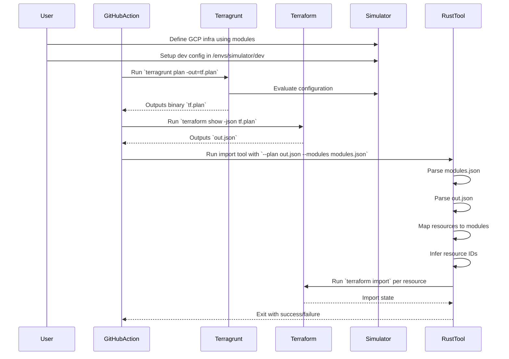

```mermaid
sequenceDiagram
    participant User
    participant GitHubAction
    participant Terragrunt
    participant Terraform
    participant Simulator
    participant RustTool

    User->>Simulator: Define GCP infra using modules
    User->>Simulator: Setup dev config in /envs/simulator/dev

    GitHubAction->>Terragrunt: Run `terragrunt plan -out=tf.plan`
    Terragrunt->>Simulator: Evaluate configuration
    Terragrunt-->>GitHubAction: Outputs binary `tf.plan`

    GitHubAction->>Terraform: Run `terraform show -json tf.plan`
    Terraform-->>GitHubAction: Outputs `out.json`

    GitHubAction->>RustTool: Run import tool with `--plan out.json --modules modules.json`

    RustTool->>RustTool: Parse modules.json
    RustTool->>RustTool: Parse out.json
    RustTool->>RustTool: Map resources to modules
    RustTool->>RustTool: Infer resource IDs
    RustTool->>Terraform: Run `terraform import` per resource

    Terraform-->>RustTool: Import state
    RustTool-->>GitHubAction: Exit with success/failure

```