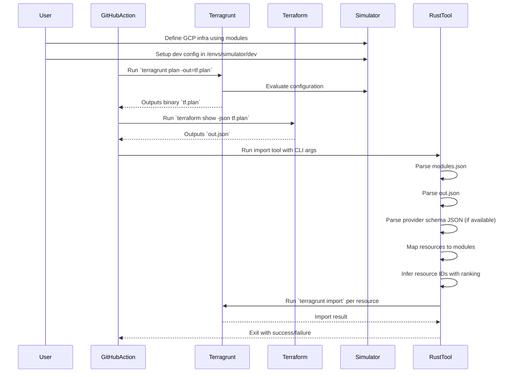
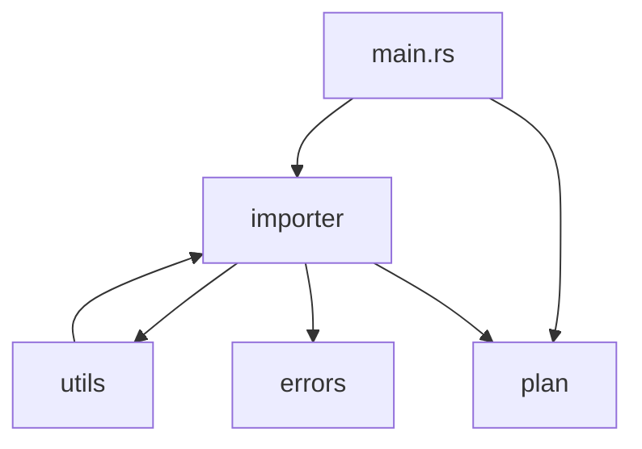
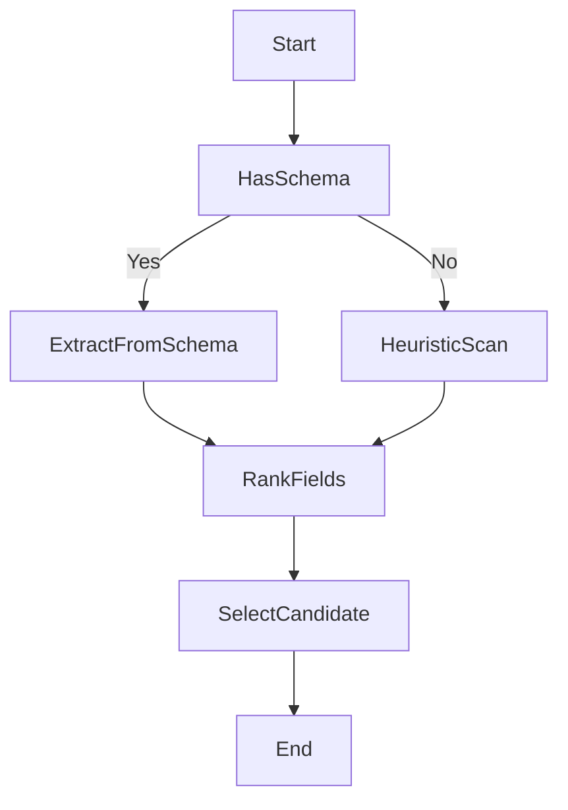
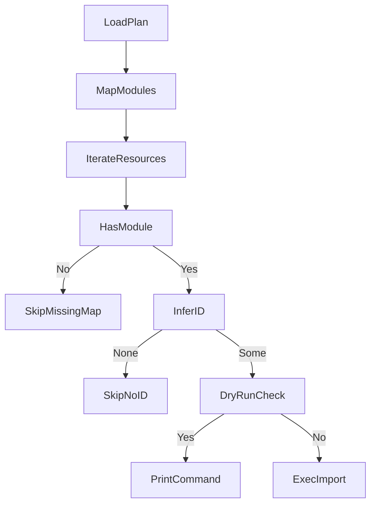
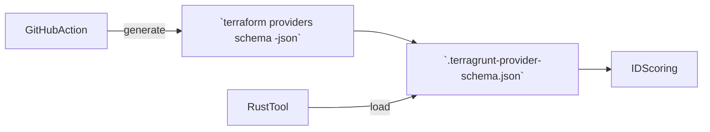

### Architecture Overview

This document outlines key flows and relationships within the `terragrunt-import-from-plan` tool.

---

### 🧭 Plan-to-Import Sequence

---

### 🧱 Rust Module Structure

---

### 🔎 ID Inference Flow

---

### 📦 Import Execution Flow

---

### 🛠️ Terraform Schema Source

This complements the `planned_values` schema and enables more precise attribute scoring for resource import ID inference.
