### Architecture Overview

This document outlines key flows and relationships within the `terragrunt-import-from-plan` tool.

---

### 🧭 Plan-to-Import Sequence


---

### 🧱 Rust Module Structure


---

### 🔧 Fixture Generation Workflow

```mermaid
flowchart TD
    Start[cargo run -- generate-fixtures provider] --> Clean[Clean workspace]
    Clean --> Init[terragrunt init --all]
    Init --> InitSuccess{Init Success?}
    InitSuccess -- No --> FailInit[Continue with warning<br/>Expected in CI]
    InitSuccess -- Yes --> Schema[Generate provider schema]
    FailInit --> Schema
    Schema --> Plan[terragrunt plan --all -out=out.tfplan]
    Plan --> PlanSuccess{Plan Success?}
    PlanSuccess -- No --> FailPlan[FAIL IMMEDIATELY<br/>Real infrastructure required]
    PlanSuccess -- Yes --> FindPlans[Find .tfplan files recursively]
    FindPlans --> Convert[terragrunt show -json out.tfplan]
    Convert --> ConvertSuccess{Conversion Success?}
    ConvertSuccess -- No --> FailConvert[FAIL IMMEDIATELY<br/>Invalid plan data]
    ConvertSuccess -- Yes --> GenModules[Generate modules.json dynamically]
    GenModules --> WriteFixtures[Write real fixtures to tests/fixtures/]
    WriteFixtures --> Success[✅ Real fixtures ready]
    
    style FailPlan fill:#ff6b6b,stroke:#d63031,stroke-width:3px
    style FailConvert fill:#ff6b6b,stroke:#d63031,stroke-width:3px
    style Success fill:#00b894,stroke:#00a085,stroke-width:2px
```



---

### 🔎 ID Inference Flow


---

### 📦 Import Execution Flow


---

### 🛠️ Terraform Schema Source

```mermaid
flowchart LR
    RustTool -->|internal generate| ProviderSchemaCmd[`write_provider_schema()`]
    ProviderSchemaCmd --> FileOutput[`.terragrunt-provider-schema.json`]
    RustTool -->|load| FileOutput
    FileOutput --> IDScoring[ID Scoring & Inference]
```

This complements the `planned_values` schema and enables more precise attribute scoring for resource import ID inference. Schema generation is now handled internally by the Rust tool during fixture generation.
