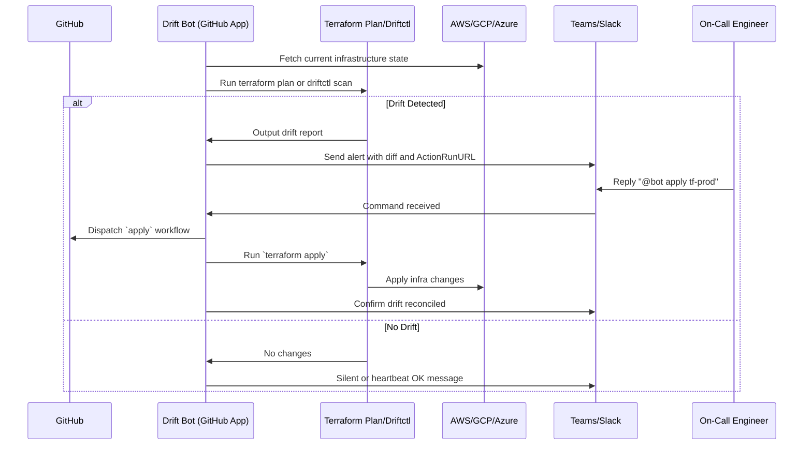

# 🛰️ Terraform Drift Detection Bot

**Detect. Alert. Maintain Infrastructure Integrity.**

> The Terraform Drift Detection Bot helps teams maintain infrastructure consistency by continuously monitoring for out-of-band changes to cloud infrastructure managed by Terraform. When drift is detected, the bot notifies the appropriate team via Slack, Teams, or any webhook, and supports on-call-triggered remediation directly from chat.

---

## 🔍 What Is Drift?

**Infrastructure drift** happens when the real-world state of cloud resources diverges from the intended state described in Terraform code. This can happen when:

* Someone manually changes cloud settings via the console
* A script modifies infrastructure without updating code
* A policy is applied outside GitOps flows

The Drift Bot continuously scans and **notifies** teams about these inconsistencies before they lead to incidents.

---

## ✨ Features

| Feature                      | Description                                                                                     |
| ---------------------------- | ----------------------------------------------------------------------------------------------- |
| 🌐 Multi-Cloud Support       | Supports AWS, GCP, and Azure via Terraform or driftctl.                                         |
| 🧠 Drift Detection           | Uses `terraform plan` or `driftctl` to detect divergence from declared state.                   |
| 📅 Scheduled & Event-Driven  | Periodic scans or real-time push via cloud-native event hooks (Config, Audit logs, Event Grid). |
| 🔔 Alert Routing             | Sends drift alerts to Slack, MS Teams, WhatsApp, PagerDuty, or any webhook.                     |
| 🧑‍💻 ChatOps Integration    | Allows on-call responders to trigger `terraform apply` directly from Teams.                     |
| 📦 GitHub Actions & External | Runs as GitHub Actions or external service. Secure secret storage supported.                    |
| ✅ Safe Apply Preview         | Verifies user-triggered applies before running them with audit logs.                            |
| 🔐 IAM-Aware                 | Runs with scoped credentials and optional OIDC support.                                         |

---

## 🛠 Architecture Overview

---

## ✅ Supported Triggers

* **GitHub Scheduled Workflow** (`cron`) — e.g., hourly or daily plan checks
* **Cloud-native Push Events**

  * AWS Config + SNS → webhook
  * GCP Audit Log → Pub/Sub → webhook
  * Azure Event Grid → Azure Function

---

## 📦 Deployment Modes

* **GitHub Actions Mode**

  * Setup drift detection with scheduled `terraform plan`
  * Integrate Slack/Teams notifications

* **External Bot Mode**

  * Run as Node.js/Go/Python app with webhook listener
  * Responds to cloud event streams and chat commands

---

## 🛡️ Security

* Authenticated GitHub App with minimal org/repo permissions
* Cloud credentials via Workload Identity or OIDC
* Chat command access restricted by RBAC
* Auditable drift actions with timestamps and approvals

---

## 🧩 Who Should Use This?

* **DevOps Engineers**: Stay informed about unauthorized cloud infra changes.
* **Platform Teams**: Enforce GitOps discipline in Terraform workflows.
* **Release Managers**: Ensure staging/prod remain in declared state.
* **SREs / On-call**: Be alerted and resolve drift in seconds—right from chat.

---

## 🧪 Example Use Case

**Scenario:** An EC2 instance’s instance type is manually changed to `t2.small` in AWS Console.

* Bot detects drift in nightly plan:

  > Drift detected: `aws_instance.webserver` → `t2.micro` expected, found `t2.small`
* Posts alert in Teams with approve link.
* On-call types:

  > `@driftbot apply prod`
* Terraform plan is re-validated, and apply is triggered securely.
* Bot confirms reconciliation in channel.

---

## 🧠 Design Philosophy

* **Proactive Detection**: Catch infra drift *before* Terraform apply fails.
* **Push over Poll**: Use event-based cloud notifications when possible.
* **GitOps Compatible**: Integrates cleanly into existing IaC and GitHub pipelines.
* **Minimal Surface Area**: No long-lived credentials or elevated access outside purpose scope.

---

## 📊 Metrics & Reporting

* Drift rate by project/environment
* Time to resolution (TTR)
* Command execution audit trail
* Alerts per week by severity or resource type

---

## 📄 License

MIT © YourCompany. Community and commercial support options available.

---

> Feedback? Join the #driftbot channel or file an issue on GitHub.
